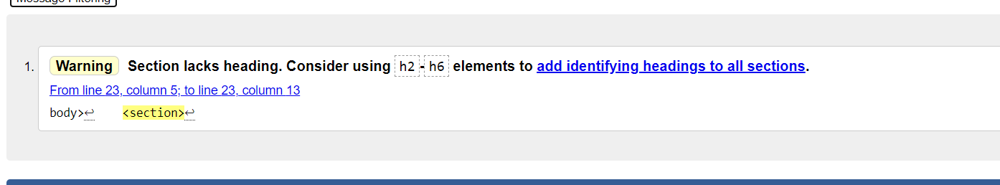

[ 🠔 Back to ReadMe ](../readme.md)

# Table of Contents 
1. [Code Validators](#code-validators)
    - [Python](#python)
    - [JavaScript](#javascript)
    - [CSS](#css)
    - [HTML](#html)
2. [User Stories](#user-stories)
3. [Feedback](#feedback)

# Code Validators
## Python

* The _app.py_ file passed the [PEP8 validator](http://pep8online.com/) with no errors.

## JavaScript

* The _script.js_ file passed the [JavaScript Validator](https://beautifytools.com/javascript-validator.php) when "jQuery" option is selected, without warnings or errors.

## CSS

* The _style.css_ file passed the [CSS Validator](https://jigsaw.w3.org/css-validator/#validate_by_input) with no errors or warning.

## HTML

* On deployed site, right-click and select "View Page Source". This is the final, rendered HTML. This HTML for each page was put through the HTML validator. Each page's HTML passed with only the above warning, which can be ignored (the decision not to add a section heading is intentional).

[⇧ Back to Top](#table-of-contents)

# User Stories

Each of the user stories was used as a starting point to test each of the features on the site, and ensure that they are accessible and work correctly.
These were tested on both mobile and desktop resolutions.

1. **As a _site administrator_, I want to upload recipes to the site for the _end-user_ to view. I want to be able to edit and delete these recipes if needed.**
    
    ✔  Once logged in (see #3), the _Add New Recipe_ button appears.

    ✔  The button directs the user to the relevant page, where an intuitive form allows them to add a new recipe.

    ✔  Once the form is submitted, a confirmation flash message appears, and the recipe is successfully added to the site.

    ✔  _Edit_ and _Delete_ buttons are visible overlaying the image of each recipe.

    ✔  The _Edit_ button directs the user to the relevant page where they can easily edit the properties of the recipe.

    ✔  The _Delete_ button opens a model which asks for confirmation to delete the recipe. Once confirmed, the recipe is deleted, and a success flash message appears.

2. **As a _site administrator_, I want to sort the recipes into separate categories for ease of browsing. I want to be able to rename or delete these categories, and add new categories in future.**

    ✔  Once logged in as admin, the _Manage Categories_ button appears.

    ✔  The button redirects the admin to the relevant page, where the _Add Category_ function is clearly visible, as well as _Rename_ and _Delete_ buttons for each existing category.

    ✔  The _Add Category_ form works correctly and displays a success message.

    ✔  The _Rename_ button opens a modal window which allows the user to rename the category; this works correctly and displays a confirmation message thereafter.

    ✔  The _Delete_ button opens a modal which asks for confirmation to delete the category. Once confirmed, the category is deleted, and a success message appears.

3. **As a _site administrator_, I want to ensure that only I can alter the content of the website.**

    ✔  At the bottom of each page, the _Admin Login_ link is visible when not logged in. When logged in, it appears as _Logout as admin_.

    ✔  This link redirects the user to the _Admin Login_ page where they can enter the relevant login details.

    ✔  Once authenticated, the user is redirected to the homepage and admin features are revealed (see #1 and #2).

4. **As an _end-user_, I want to browse recipes relevant to me; including searching through them using search terms, or view only Breakfast recipes.**

    ✔  Recipes are loaded on the homepage. The _search_ function is intuitive and finds recipes according to user search queries. The category dropdown successfully loads recipes in the chosen category.

    ✔  When clicked, a new page will load for each recipe displaying the full details of the recipe.

5. **As an _end-user_, I want to share a good recipe I found on the site with my friends on social media.**

    ✔  Once a recipe page is loaded, _Share_ and _Tweet_ buttons appear below the recipe image.

    ✔  These buttons opens a new tab in either _Facebook_ or _Twitter_, passing each site the page URL to be shared on the social media platform.

[⇧ Back to Top](#table-of-contents)

# Feedback 

The site was shown to peers and fellow developers who were encouraged to interact with the site and provide their feedback. Overall response from users was positive and no new bugs were encountered. 

My [CodeInstitute](http://www.codeinstitute.net/) mentor, Arnold Kyeza, returned constructive feedback and advice at multiple stages throughout the project.

[⇧ Back to Top](#table-of-contents)