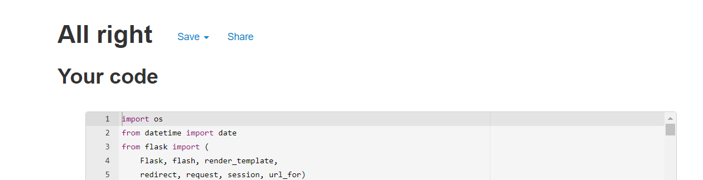
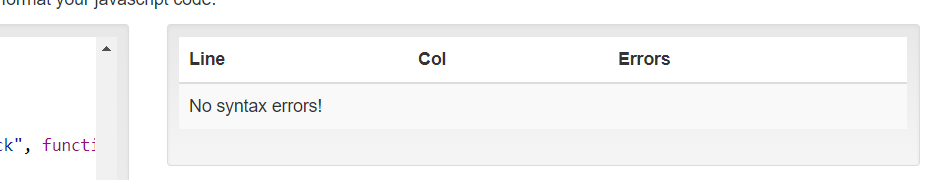
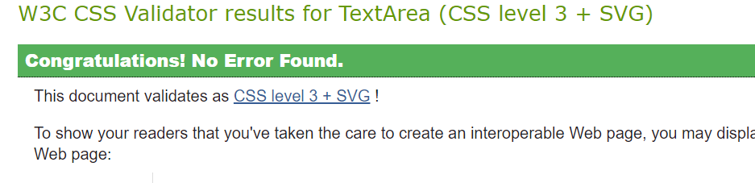

[ 🠔 Back to ReadMe ](../readme.md)

# Table of Contents 
1. [Code Validators](#code-validators)
    - [Python](#python)
    - [JavaScript](#javascript)
    - [CSS](#css)
    - [HTML](#html)
2. [User Stories](#user-stories)
3. [Feedback](#feedback)

# Code Validators
## Python

* The _app.py_ file passed the [PEP8 validator](http://pep8online.com/) with no errors.

## JavaScript

* The _script.js_ file passed the [JavaScript Validator](https://beautifytools.com/javascript-validator.php) when "jQuery" option is selected, without warnings or errors.

## CSS

* The _style.css_ file passed the [CSS Validator](https://jigsaw.w3.org/css-validator/#validate_by_input) with no errors or warning.